# The Pentagon Official WriteUp

Here’s what the challenge looks like:

<div align="center">
    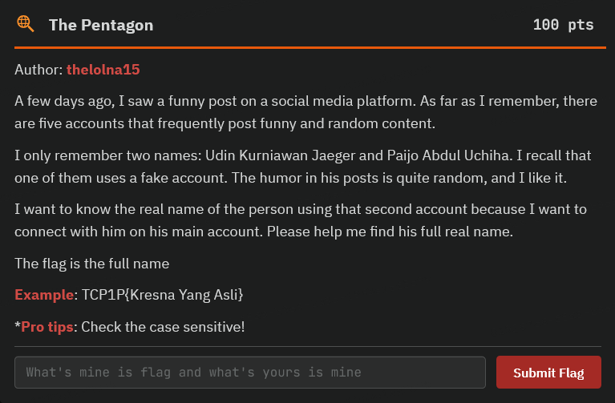
</div>

From the challenge description, we get the following information:
1. There are five accounts posting funny content.
2. Two names are mentioned: 'Udin Kurniawan Jaeger' and 'Paijo Abdul Uchiha.'
3. One of the five accounts is a fake account.

Your task is to find the real name of the fake account.

## Step One

Try using Google Dork, for example, by using quotation marks `""` to search for the accounts.

### Udin
<div align="center">
    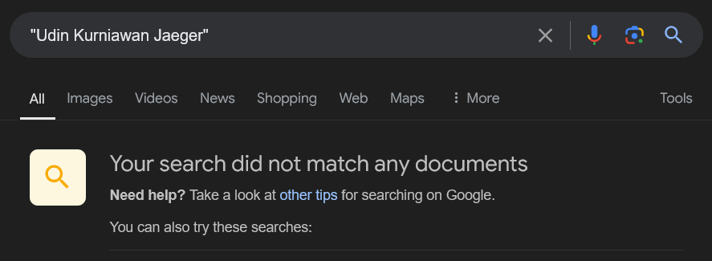
</div>

### Paijo
<div align="center">
    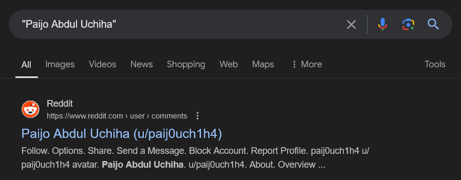
</div>

From the images above, one of the Reddit accounts was found. But when you open it, it’s a dead end.

<div align="center">
    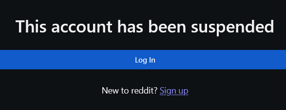
</div>

But wait... don’t get disappointed yet! There’s something useful here. We’ve managed to get the username of the account, which is `paij0uch1h4`, and this can help us search for the account on other social media platforms. While there are tools to make this search easier, let’s do it manually for now.

## Step Two

To search for the account, you can use resources like the [OSINT Framework](https://osintframework.com).

<div align="center">
    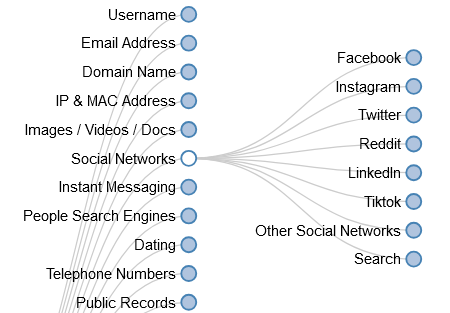
</div>

Try searching each social media platform listed in the OSINT Framework, like Facebook, Instagram, Twitter (X), Reddit, LinkedIn, and TikTok.

Here’s a cheatsheet for finding accounts on those platforms:

1. Facebook: `https://www.facebook.com/[username]`
2. Instagram: `https://www.instagram.com/[username]`
3. Twitter (X): `https://x.com/[username]`
4. Reddit: `https://www.reddit.com/user/[username]`
5. LinkedIn: `https://www.linkedin.com/in/[username]`
6. TikTok: `https://www.tiktok.com/@[username]`

Finally, we found the account on Twitter (X). Here’s what Paijo’s account looks like:

<div align="center">
    
</div>

Next, search the posts for clues that may guide you to the next step.

## Step Three

From the posts on paij0uch1h4’s account, we found two users who commented: `Udin Kurniawan Jaeger` with the username `ud1nwanj4eger` and `Paimen Budiono Siregar` with the username `paim3nbudg4r`. Additionally, the post mentions, "Accounts @paij0uch1h4 follows or mentioned can reply." That means we now have three accounts in play.

[Twitter (X) Post - Paijo](https://x.com/paij0uch1h4/status/1844338833988759927)

<div align="center">
    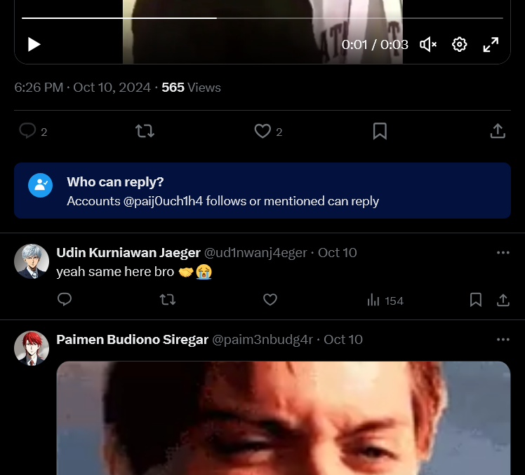
</div>

## Step Four

Search through posts from both accounts and don’t forget to check the comments.

In Udin’s post [here](https://x.com/paij0uch1h4/status/1844338833988759927), there are several comments and replies.

<div align="center">
    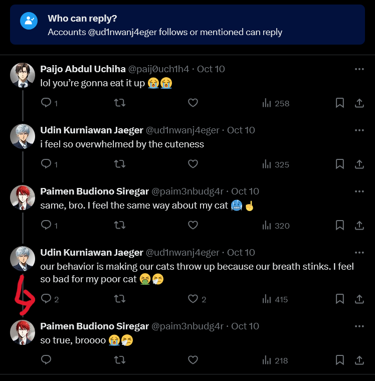
</div>

One of the replies reveals that Udin has a post on the social media platform '9GAG.'

<div align="center">
    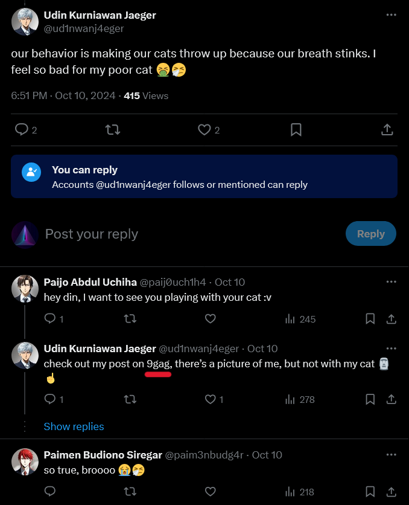
</div>

This clue leads us to the next step.

## Step Five

Search for Udin’s account on 9GAG. You can either create an account or use the following parameter to search: `https://9gag.com/u/[username]`.

[9GAG - Udin](https://9gag.com/u/ud1nwanj4eger/posts)

<div align="center">
    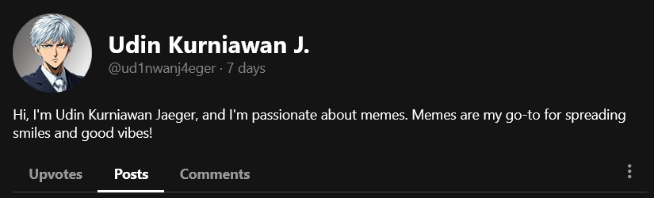
</div>

In Udin’s [post](https://9gag.com/gag/avy85Bd#comment), there are several comments, including one revealing that Udin has a friend named `Xalamender` with the username `s1k3nts0`. There’s also info that Xalamender is a meme lover and has a post on an app with the photo logo, with the post ID 'DAJjWLRzVpw.'

<div align="center">
    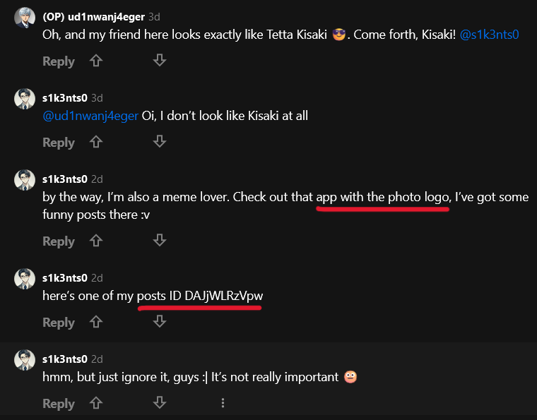
</div>

Hmm, could this be Instagram? Let’s check it out.

[ChatGPT](https://chatgpt.com/share/670c713c-3010-8011-ae74-6e7c60930352)

<div align="center">
    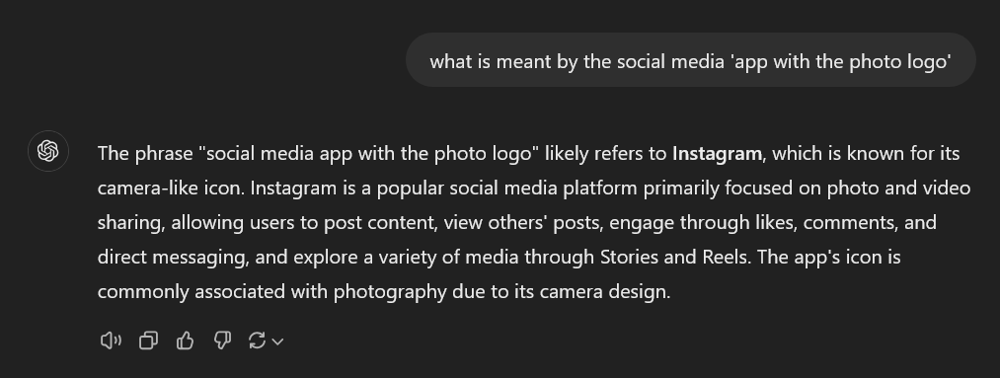
</div>

[Gemini](https://g.co/gemini/share/9a4434a24d1f)

<div align="center">
    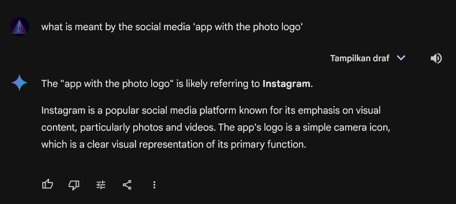
</div>

[Bing Copilot](https://copilot.microsoft.com)

<div align="center">
    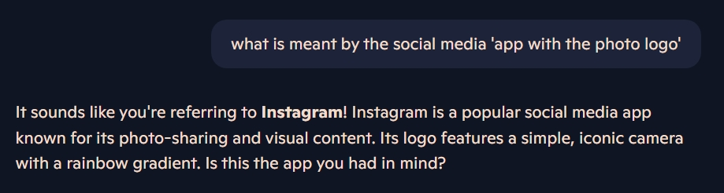
</div>

All results point to Instagram.

## Step Six

Check Instagram with the post ID 'DAJjWLRzVpw.'

[Instagram Post - Xalamender](https://www.instagram.com/p/DAJjWLRzVpw)

<div align="center">
    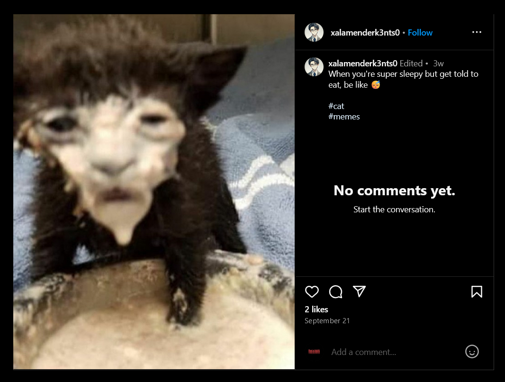
</div>

Yep, that’s right. Let’s check Xalamender’s profile with the username `xalamenderk3nts0`.

[Instagram - Xalamender](https://www.instagram.com/xalamenderk3nts0/)

<div align="center">
    
</div>

In the bio, there’s a Discord server link. Let’s join and see what we find.

[Discord Server](discord.gg/KYcX8Jh8Md)

<div align="center">
    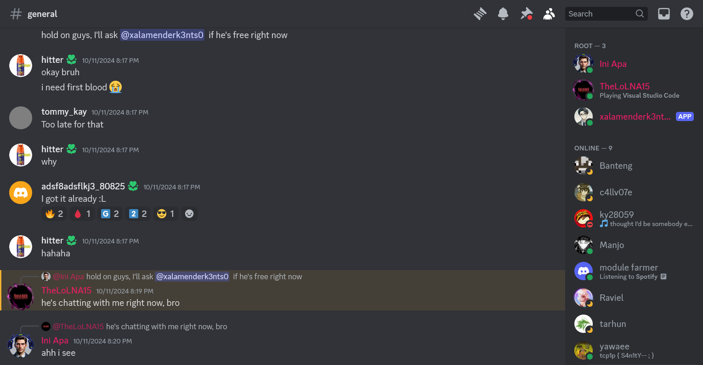
</div>

When we check the pinned messages, we find that `TheLoLNA15` is chatting with `xalamenderk3nts0`.

<div align="center">
    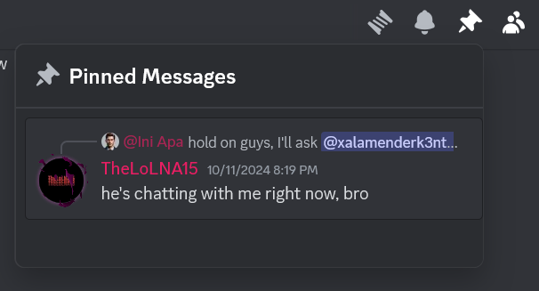
</div>

What happens if we chat with `xalamenderk3nts0`?

<div align="center">
    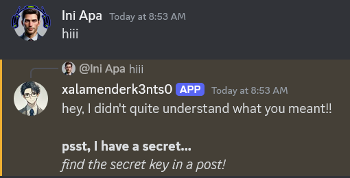
</div>

Wow, Xalamender has a secret and says there’s a key in one of their posts. Let’s find it.

# Step Seven

Search through Xalamender’s Instagram posts, and there’s one suspicious post. Here’s [the post](https://www.instagram.com/p/DA-7LchCpbI). In the comments, someone says, 'Wow, the spell is pure magic 😶‍🌫️.' It seems there’s a hidden spell inside.

The spell is spoken from second 37 to 46. Here’s the spell:

https://github.com/user-attachments/assets/749a7911-0c84-42a3-b1cf-bc0416587ed9

It sounds reversed, so let’s reverse it and see what we find.

https://github.com/user-attachments/assets/ed917306-8c49-4620-aa9b-67a3c32eb91b

After listening, the spell turns out to be `tcp1p_th3p3nt490n_1s4w3s0m3`. Let’s give this spell to Xalamender and see if they reveal the secret.

<div align="center">
    
</div>

Wow, it worked! Xalamender reveals a secret video link. After watching the video, we discover that

 Xalamender’s real name is `Slamet Setiawan Uzumaki` 😱😱

[YouTube Solved](https://youtu.be/cVeBJxAsniM)

<div align="center">
    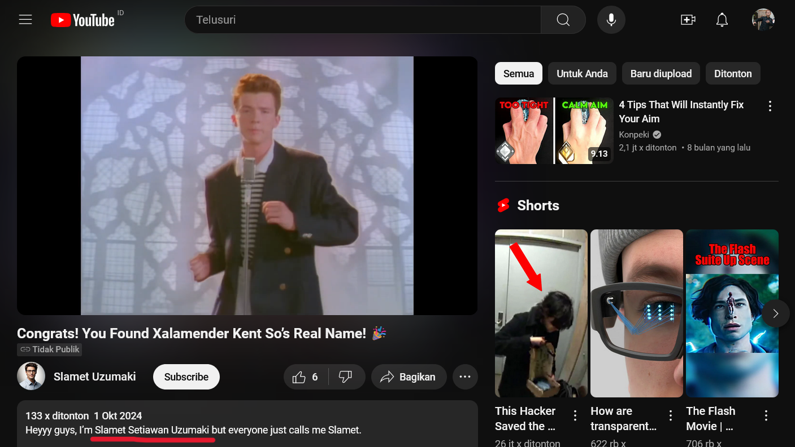
</div>

### Flag : 
```
TCP1P{Slamet Setiawan Uzumaki}
```
