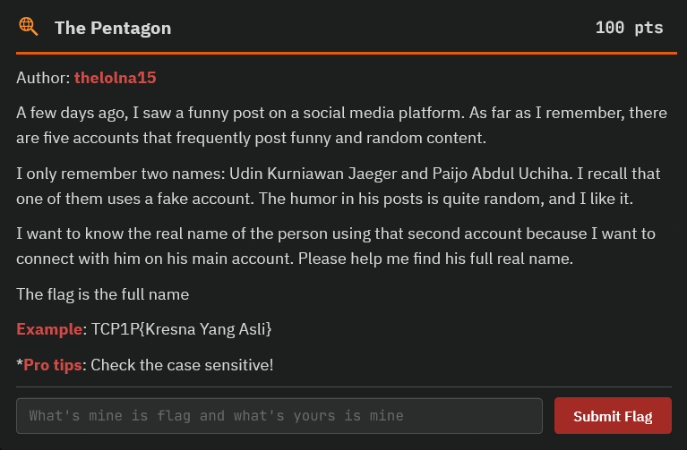
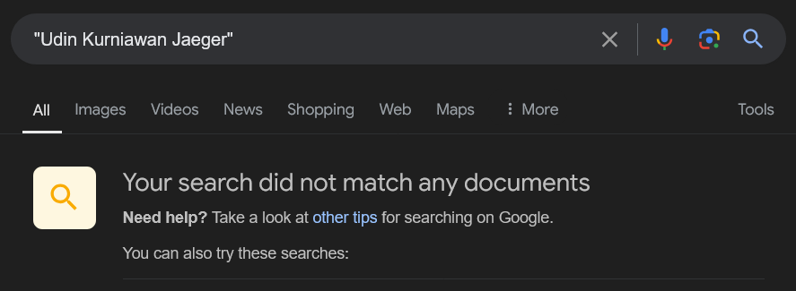
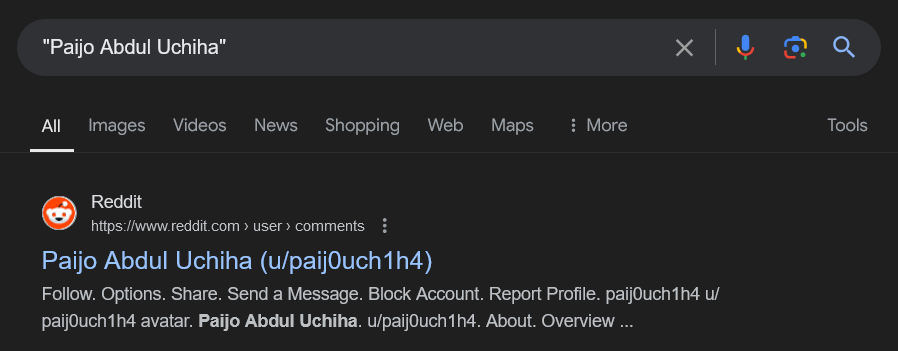
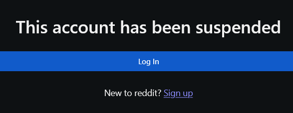
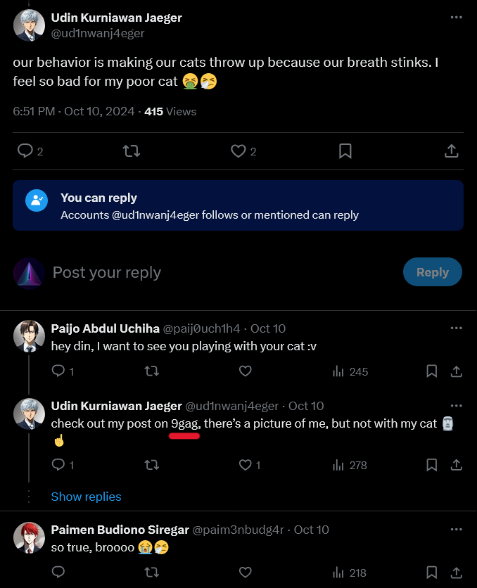
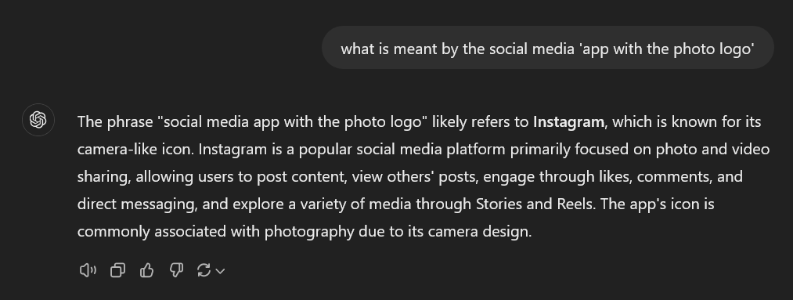
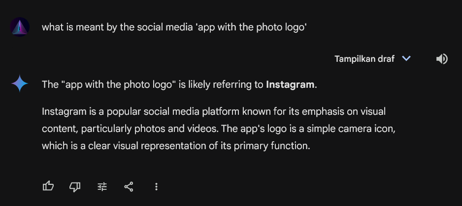
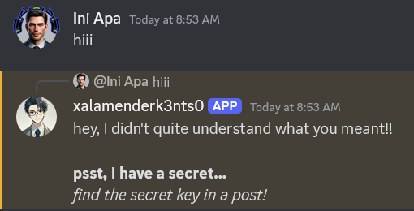

# The Pentagon Official WriteUp

Berikut adalah tampilan soalnya

<div align="center">
    
</div>

Dari deskripsi soal, terdapat beberapa informasi berikut:
1. Ada lima akun yang memposting konten lucu.
2. Disebutkan dua nama, yaitu 'Udin Kurniawan Jaeger' dan 'Paijo Abdul Uchiha.'
3. Dari kelima akun tersebut, satu di antaranya adalah akun palsu.

Tugasnya adalah menemukan nama asli dari akun palsu tersebut.

## Langkah Pertama

Cobalah memanfaatkan fitur Google Dork, misalnya dengan menggunakan tanda `""` untuk mencari akun tersebut.

### Udin
<div align="center">
    
</div>

### Paijo
<div align="center">
    
</div>

Pada gambar di atas, salah satu akun pengguna Reddit berhasil ditemukan. Namun, ketika dibuka, hasilnya zonk.

<div align="center">
    
</div>

Eitss... jangan langsung kecewa, ada hikmah di balik ini. Sekarang kita sudah berhasil mendapatkan username dari akun tersebut yaitu `paij0uch1h4`, dan ini bisa memudahkan kita mencari akun tersebut di media sosial lain. Sebenarnya, ada tools yang bisa digunakan untuk mempermudah pencarian, tapi kali ini kita akan menggunakan teknik manual.

## Langkah Kedua

Untuk mencari akun tersebut, bisa menggunakan referensi dari [OSINT Framework](https://osintframework.com)

<div align="center">
    
</div>

Cobalah cari satu per satu di media sosial yang tercantum di OSINT Framework, seperti Facebook, Instagram, Twitter (X), Reddit, LinkedIn, dan Tiktok.

Berikut adalah cheatsheet parameter untuk mencari akun di media sosial tersebut:

1. Facebook: `https://www.facebook.com/[username]`
2. Instagram: `https://www.instagram.com/[username]`
3. Twitter (X): `https://x.com/[username]`
4. Reddit: `https://www.reddit.com/user/[username]`
5. LinkedIn: `https://www.linkedin.com/in/[username]`
6. Tiktok: `https://www.tiktok.com/@[username]`

Dan akhirnya, kita berhasil menemukan akun tersebut di media sosial Twitter (X). Berikut adalah tampilan akun milik Paijo:

<div align="center">
    
</div>

Setelah itu, cari informasi dari postingan yang mungkin menjadi petunjuk untuk langkah selanjutnya.

## Langkah Ketiga

Dari hasil pencarian di postingan milik paij0uch1h4, ditemukan dua akun yang berkomentar di sana, yaitu `Udin Kurniawan Jaeger` dengan username `ud1nwanj4eger` dan `Paimen Budiono Siregar` dengan username `paim3nbudg4r`. Selain itu, ada informasi bahwa di postingan tersebut tertulis, 'Accounts @paij0uch1h4 follows or mentioned can reply.' Artinya, kita sudah berhasil mengantongi tiga akun yang dimaksud.

[Postingan Twitter (X) - Paijo](https://x.com/paij0uch1h4/status/1844338833988759927)

<div align="center">
    
</div>

## Langkah Keempat

Cari dan telusuri postingan dari kedua akun tersebut, jangan lupa juga untuk membuka setiap komentar yang ada.

Pada postingan Udin berikut [ini](https://x.com/paij0uch1h4/status/1844338833988759927), terdapat beberapa komentar, dan ada juga balasan untuk beberapa komentar tersebut.

<div align="center">
    
</div>

Ketika balasannya dibuka, terdapat informasi bahwa Udin juga memiliki sebuah postingan di platform media sosial '9GAG'.

<div align="center">
    
</div>

Petunjuk inilah yang membawa kita ke langkah berikutnya.

## Langkah Kelima

Cobalah mencari akun Udin di 9GAG. Bisa membuat akun terlebih dahulu, atau langsung menggunakan parameter berikut untuk mencari akunnya: `https://9gag.com/u/[username]`.

[9GAG - Udin](https://9gag.com/u/ud1nwanj4eger/posts)

<div align="center">
    
</div>

Pada postingan Udin yang [ini](https://9gag.com/gag/avy85Bd#comment), terdapat beberapa komentar yang cukup ramai. Ada informasi penting bahwa Udin memiliki teman bernama `Xalamender` dengan username `s1k3nts0`. Selain itu, ada juga informasi bahwa Xalamender adalah penggemar meme dan memiliki sebuah postingan di aplikasi berlogo foto, dengan post ID 'DAJjWLRzVpw'.

<div align="center">
    
</div>

Hmm, apakah yang dimaksud dengan Xalamender adalah Instagram? Untuk mengetahuinya, mari kita coba cek.

[ChatGPT](https://chatgpt.com/share/670c713c-3010-8011-ae74-6e7c60930352)

<div align="center">
    
</div>

[Gemini](https://g.co/gemini/share/9a4434a24d1f)

<div align="center">
    
</div>

[Bing Copilot](https://copilot.microsoft.com)

<div align="center">
    
</div>

Dari hasil yang ada, semuanya merujuk ke aplikasi Instagram.

## Langkah Keenam

Coba cek di instagram dengan id postingan 'DAJjWLRzVpw'.

[Postingan Instagram - Xalamender](https://www.instagram.com/p/DAJjWLRzVpw)

<div align="center">
    
</div>

Yapss, ternyata benar. Mari kita cek profil akun Xalamender dengan username `xalamenderk3nts0`.

[Instagram - Xalamender](https://www.instagram.com/xalamenderk3nts0/)

<div align="center">
    
</div>

Di bio nya terdapat sebuah link server Discord. Mari coba kita coba masuk, dan apa yang bakal kita temukan.

[Discord Server](discord.gg/KYcX8Jh8Md)

<div align="center">
    
</div>

Dan jika kita cek pin-nya, terdapat informasi bahwa `TheLoLNA15` sedang chatting dengan `xalamenderk3nts0`.

<div align="center">
    
</div>

Apa yang terjadi jika kita chat `xalamenderk3nts0`.

<div align="center">
    
</div>

Wahh, ternyata Xalamender memiliki sebuah rahasia, dan katanya ada sebuah kunci di salah satu postingannya. Mari kita cari kunci tersebut.

# Langkah Ketujuh

Coba gali di postingan Instagram nya, dan ada satu postingan yang terlihat mencurigakan. Berikut adalah [postingannya](https://www.instagram.com/p/DA-7LchCpbI). Dari komentar seperti 'Wow, the spell is pure magic 😶‍🌫️', tampaknya ada sebuah mantra tersembunyi di dalamnya.

Mantra tersebut diucapkan pada detik ke 37 hingga 46. Berikut adalah mantra yang diucapkan.

https://github.com/user-attachments/assets/749a7911-0c84-42a3-b1cf-bc0416587ed9

Dari suara tersebut, kita bisa berasumsi bahwa suaranya diputar secara terbalik, sehingga terdengar tidak jelas. Mari kita coba membalikkan suaranya dan lihat apa yang terjadi.

https://github.com/user-attachments/assets/ed917306-8c49-4620-aa9b-67a3c32eb91b

Setelah didengarkan, ternyata mantranya adalah `tcp1p_th3p3nt490n_1s4w3s0m3`. Selanjutnya, mari kita coba berikan mantra ini kepada Xalamender. Apakah dia akan memberikan rahasia yang tersembunyi?

<div align="center">
    
</div>

Wahh ternyata benar dia memberikan sebuah rahasianya berupa link videonya. setelah dibuka videonya, ternyata nama asli dari salamender adalah `Slamet Setiawan Uzumaki` 😱😱

[YouTube Solved](https://youtu.be/cVeBJxAsniM)

<div align="center">
    
</div>


### Flag : 
```
TCP1P{Slamet Setiawan Uzumaki}
```
